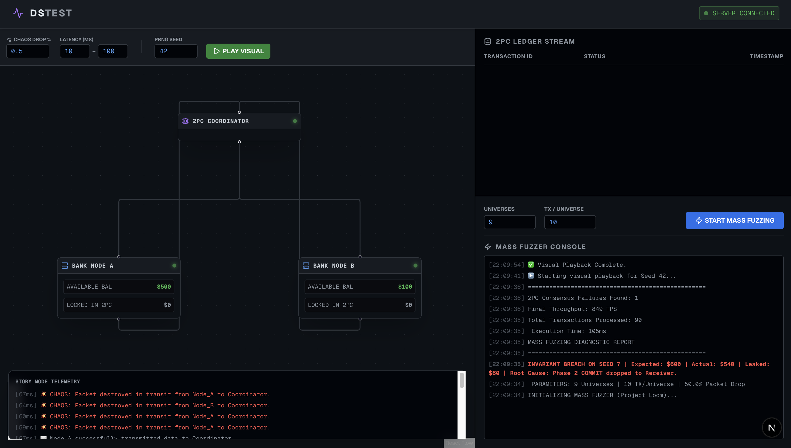
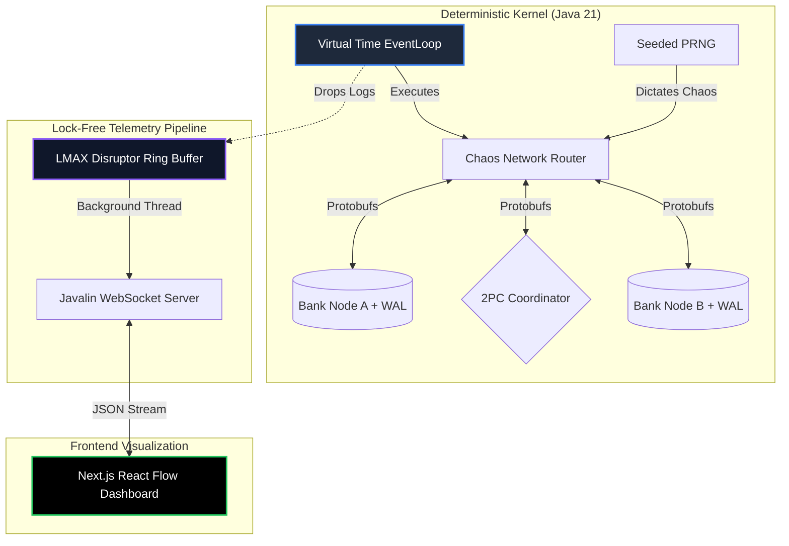

# DSTest: Deterministic Simulation Testing Framework


A local testing framework built in **Java 21** to simulate network failures and 100% reliably reproduce race conditions in a distributed financial ledger. 



## 📌 Project Overview
Testing distributed consensus algorithms is notoriously difficult because real-world network latency and OS thread scheduling are unpredictable, leading to "Heisenbugs" (bugs that disappear when you try to debug them). 

This project solves that by running a mock banking cluster inside a **single-threaded, virtual-time event loop**. By using a seeded Random Number Generator to inject network packet loss, every transaction failure becomes perfectly deterministic. 

## 🏗️ System Architecture

The architecture decouples the deterministic execution engine from the high-frequency telemetry pipeline to prevent CPU cache-line bouncing.



## 🔬 What does "Deterministic Replay" actually look like?
Imagine a scenario where a transaction silently fails and money vanishes. In a normal system, finding this bug is nearly impossible. In this sandbox, it follows a strict two-step workflow:

1. **The Sledgehammer (Mass Fuzzing):** You run the Mass Fuzzer. It uses Java 21 Virtual Threads to simulate 10,000 parallel universes. At the end of the run, the terminal outputs:
   > `🚨 INVARIANT BREACH ON SEED 3788 | Expected: $600 | Actual: $550 | Root Cause: Phase 2 COMMIT dropped.`
2. **The Microscope (Visual Replay):** You open the Next.js dashboard, type `3788` into the Seed input, and click **Play Visual**. Because the physics of the engine are mathematically tied to the seed, you watch the exact sequence of events unfold in slow motion:
   * At exactly `[42ms]`, Node A locks $50.
   * At exactly `[85ms]`, the Coordinator sends the Commit message.
   * You physically watch the network cable to Node B turn **red** as the chaos engine destroys the packet. You have now visually isolated the exact boundary of the Two Generals' Problem.

## 🚀 How to Run Locally

### 1. Start the Java Backend (API & Engine)
Ensure you have **Java 21** and **Maven** installed.
```bash
cd backend
mvn clean compile
mvn exec:java -Dexec.mainClass="com.sandbox.core.Main"
```
*The backend will boot the LMAX Disruptor and sit idle, waiting for commands from the UI.*

### 2. Start the Telemetry Dashboard
Ensure you have **Node.js v20+** installed. Open a *new* terminal window:
```bash
cd frontend
npm install
npm run dev
```
* Navigate to `http://localhost:3000`. 
* Click **Start Mass Fuzzing** to run 10,000 background universes.
* Type a Seed number and click **Play Visual** to watch the ledger execute in real-time.

## 🧪 Automated Property-Based Testing
To run the headless testing suite (which asserts the global "Conservation of Money" invariant against 100 random chaos seeds without the UI):
```bash
cd backend
mvn clean test
```
*Failed tests indicate that the Chaos Network successfully forced a consensus failure, capturing the failing seed for replay.*
```
